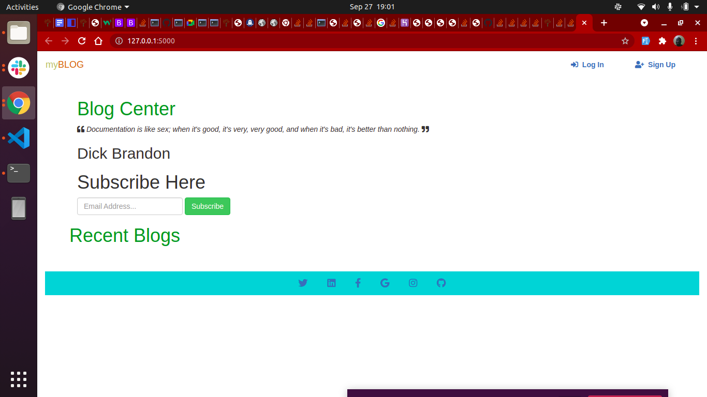
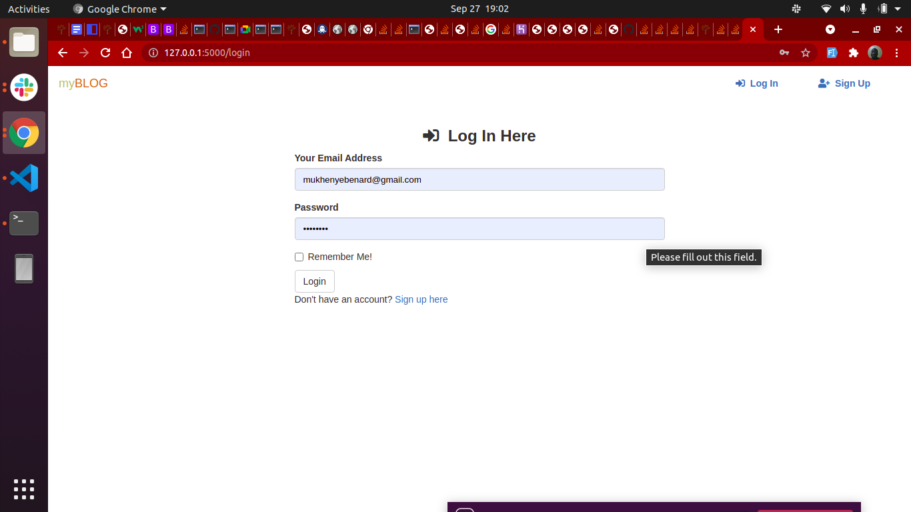
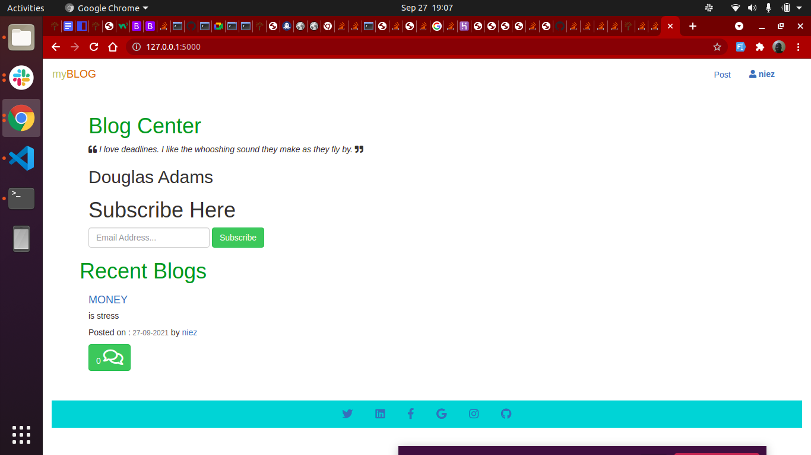

## Myblog
Is an application that allows users to create and share opinions and other users can read and comment on them. the application also has random quotes that inspire users.

## Author
Bernard Opiyo

Installation
Use the following command to install all the requirement applications. pip freeze -r requirements.txt

## setup
Run git clone https://github.com/Bernard2030/myblog-site or download the zip file from github.

After extracting the files,

Navigate to the project folder cd gitSearch.

Creating a virtual environment virtualenv virtual.

Activating the virtual environment source virtual/bin/activate.

Running the application python3 manage.py server

Running tests python3 manage.py test.

## Technologies used
** Python3.8 ** Flask ** Javascript ** HTML5 ** Bootstrap5

user story

* As a user, I would like to view the blog posts on the site
* As a user, I would like to comment on blog posts
* As a user, I would like to view the most recent posts
* As a user, I would like to get an email alert when a new post is made by joining a subscription.
* As a user, I would like to see random quotes on the site
* As a writer, I would like to sign in to the blog.
* As a writer, I would also like to create a blog from the application.
* As a writer, I would like to delete comments that I find insulting or degrading.
* As a writer, I would like to update or delete blogs I have created.
## BDD
Login Inputs

| Inputs | Description |
| ------------- | ------------- |
| Username  | Account username, eg niez |
| Password | Account password, eg @2030  |

	
	
	
Signup inputs

| Inputs  | Description |
| ------------- | ------------- |
| Username | Account username, eg niez  |
| Email | Account email e.g bro@gmail.com |
|passward|Account password, eg @2030|
|Confirm Password|Account password, eg @2030|

## pictorial Discription

	
	
	
	
	
## Known Bugs
There are no known bugs at the moment if you find any reach out through brobernard.254@gmail.com

## Collaboration
To contribute on the application you can do so by reaching me on brobernard.254@gmail.com

## LICENSE
MIT License Copyright (c) [2021] [Bernard Opiyo] Permission is hereby granted, free of charge, to any person obtaining a copy of this software and associated documentation files (the "Software"), to deal in the Software without restriction, including without limitation the rights to use, copy, modify, merge, publish, distribute, sublicense, and/or sell copies of the Software, and to permit persons to whom the Software is furnished to do so, subject to the following conditions: The above copyright notice and this permission notice shall be included in all copies or substantial portions of the Software. THE SOFTWARE IS PROVIDED "AS IS", WITHOUT WARRANTY OF ANY KIND, EXPRESS OR IMPLIED, INCLUDING BUT NOT LIMITED TO THE WARRANTIES OF MERCHANTABILITY, FITNESS FOR A PARTICULAR PURPOSE AND NONINFRINGEMENT. IN NO EVENT SHALL THE AUTHORS OR COPYRIGHT HOLDERS BE LIABLE FOR ANY CLAIM, DAMAGES OR OTHER LIABILITY, WHETHER IN AN ACTION OF CONTRACT, TORT OR OTHERWISE, ARISING FROM, OUT OF OR IN CONNECTION WITH THE SOFTWARE OR THE USE OR OTHER DEALINGS IN THE SOFTWARE.